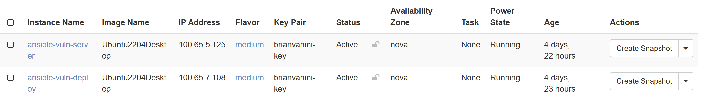
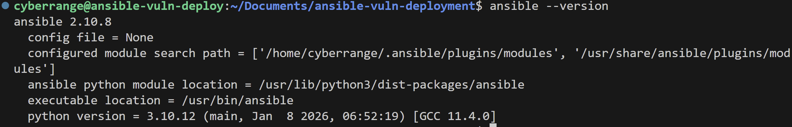
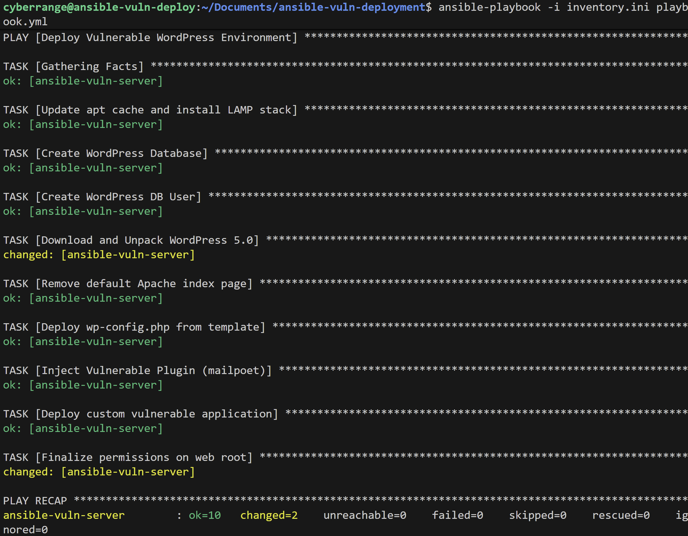
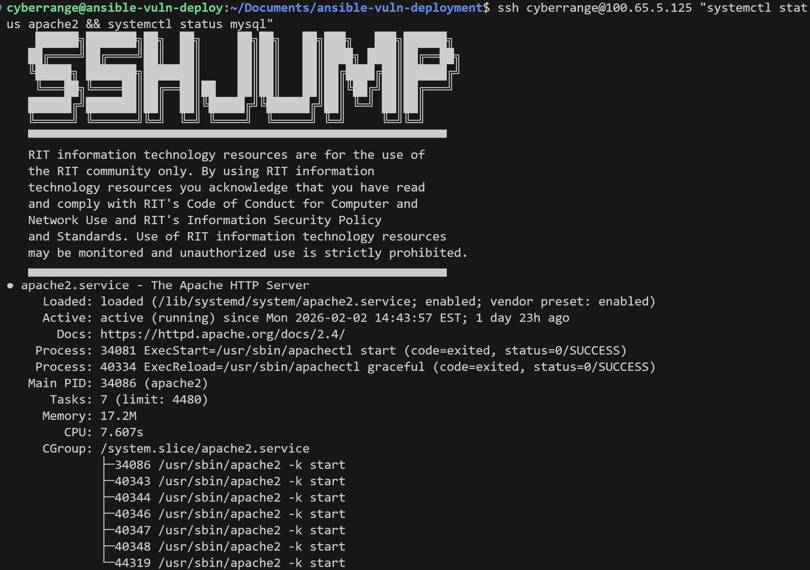
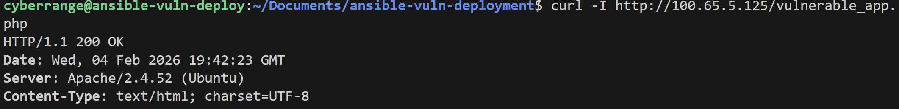

# WordPress Ansible Vulnerability Deployment 
## Prerequisites
### Create two instances in OpenStack, with these specs:
### Name one ansible-vuln-deploy (control) and the other ansible-vuln-server (target)
* **OS:** Ubuntu 22.04 LTS Desktop
* **Flavor:** medium
* **Network:** Main-NAT
* **Set up SSH for each box and ensure you have access to both**
### These boxes should look like the two I made:

## Required Install: Ansible
### On ansible-vuln-deploy, run each command below in the terminal
<pre>
    sudo su -
    passwd cyberrange
    apt update
    apt install ansible ansible-lint sshpass git curl wget python3-venv
    git clone https://github.com/BrianVanini/ansible-vuln-deployment.git
    cd ansible-vuln-deployment
</pre>
### Check if ansible was installed correctly:
<pre>
ansible --version
</pre>
### You should see:

### On ansible-vuln-server, run each command below in the terminal
<pre>
    sudo su -
    passwd cyberrange
    apt update
</pre>

### Check inventory.ini file and make sure the host_ip and user match your ansible-vuln-server
<pre>
[webservers]
ansible-vuln-server ansible_host=100.65.5.125 ansible_user=user
</pre>

### Set up SSH Trust to automate the server without stopping to ask for a password for every task:
<pre>
ssh-copy-id cyberrange@[ANSIBLE-VULN-SERVER-IP]
</pre>

## Installation & Configuration
### On ansible-vuln-deploy in folder ansible-vuln-deployment, run:
<pre>
ansible-playbook -i inventory.ini playbook.yml
</pre>
### This will do the following on ansible-vuln-server:
* **Installs Apache, MySQL, and PHP**
* **Configures the database** 
* **Downloads WordPress** 
* **Injects the vulnerable PHP script**
### You should get a response similar to below: 

## Verification Steps
### Make sure Apache and Database are running:
<pre>
ssh cyberrange@[ANSIBLE-VULN-SERVER-IP] "systemctl status apache2 && systemctl status mysql"
</pre>
### Apache Running:

### Database Running:

## Vulnerable File Check
### Check to ensure the vulnerable file has been deployed on the target machine:
<pre>
curl -I http://[ANSIBLE-VULN-SERVER-IP]/vulnerable_app.php
</pre>

#### At this point, the machines should be set up to demonstrate the vulnerability, and you may continue to the exploitation steps found in "EXPLOITATION.MD".