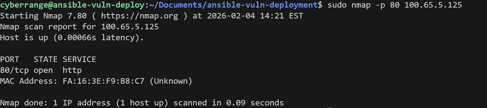
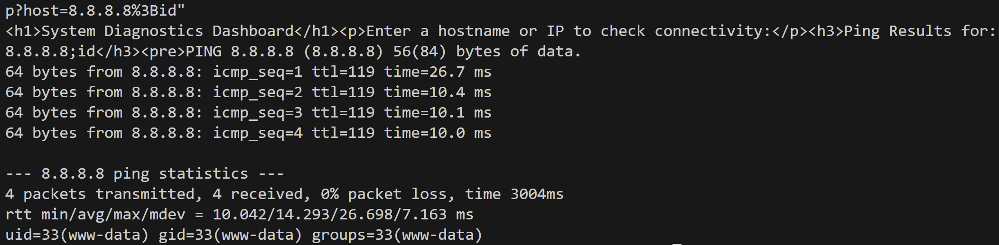
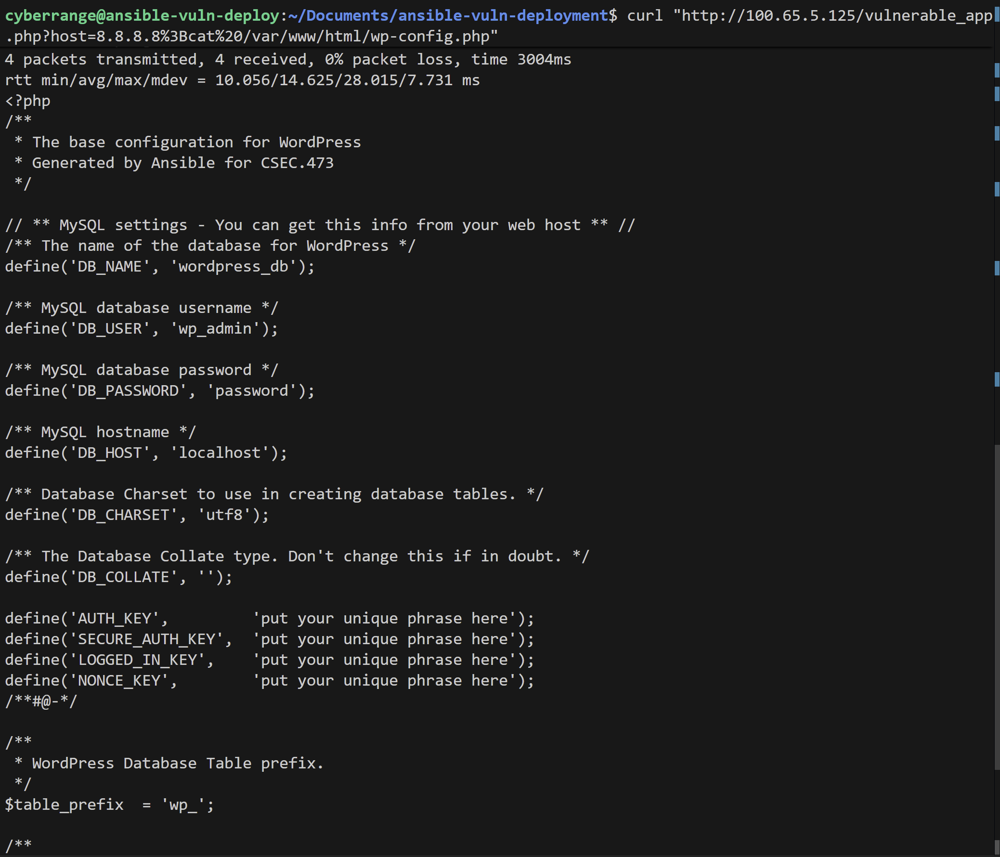

# WordPress Ansible Vulnerability Explotation
### If you have not yet successfully deployed the ansible playbook, see "DEPLOYMENT.MD" file
## Vulnerability Overview
* **Name/Type: This is a remote code execution vulnerability**
###
* **Severity: Critical - this is dangerous because an attacker can read sensitive configuration files, modify website content, steal credentials, or even use this vulnerability as a gateway to attack other systems**
###
* **Attack Vector: These attacks are very well known and any attacker can try an attack like this in any input field of a website. Inputs should be sanitized so commands cannot be run in input fields, like turning semicolons into a string of letters. Remote code execution vulnerabilities can be exploited by running crafted commands in these fields.**

## Exploitation Steps
### Reconnaissance
#### Nmap can be used as a tool for discovering network activity, let's install it.
<pre>
sudo apt update && sudo apt install -y nmap
</pre>
### Check for open target port:
<pre>
sudo nmap -p 80 [ANSIBLE-VULN-SERVER-IP] 
</pre>

#### You should see port 80 open.

### Exploitation
#### Run ping command through service:
<pre>
curl "http://[ANSIBLE-VULN-SERVER-IP]/vulnerable_app.php?host=8.8.8.8%3Bid"
</pre>
#### This command takes advantage of a remote code execution vulnerability by inserting a semicolon (%3B) into the URL, completing the ping command and then running a second command that retrieves the user_id of the operating system. We can insert any command in place of "id" and it will be run, exploiting the vulnerability.
### You should get a response similar to below. This is the user data, which can also be found in the main.yml file, which configures the server with this user name.

### We can take this command and modify it to return the entire WordPress configuration file, containing the MySQL database username and password.

<pre>
curl "http://[ANSIBLE-VULN-SERVER-IP]/vulnerable_app.php?host=8.8.8.8%3Bcat%20/var/www/html/wp-config.php"
</pre>

### Post-Exploitation
#
#### In the two examples above, we were able to steal information from the system that should not have been accessible in the first place by embedding other commands in the cURL command. 
#### A cURL command that is normally used for getting web data, can be used to run a command that runs malicious code or steals additional information, like in this example.
#### Now that the attacker has full access of the database, they can modify it as they please, dump tables, change passwords, or steal information that can potentially be sold on the dark web.

## Defensive Considerations
### Detection
#### Blue teams can detect this attack by monitoring the Apache server access log file. Since this is an http get request, the file will contain the IP of the attacker and their input.
### Mitigation
#### The best way to mitigate remote code execution attacks is to sanitize all inputs by stripping shell metacharacters to strings so commands are not run within URLs.
#### Another method for this example is to use the php function escapeshellarg(), which wraps the input in quotes, stopping commands from being run like this.